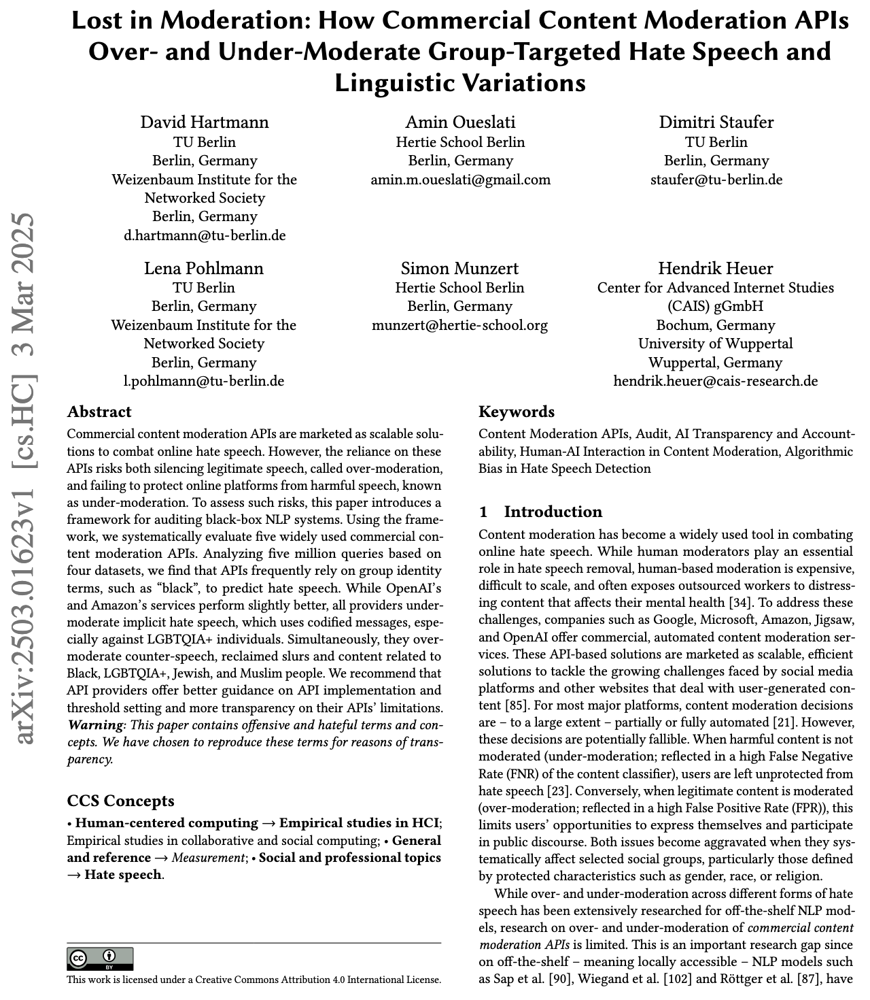
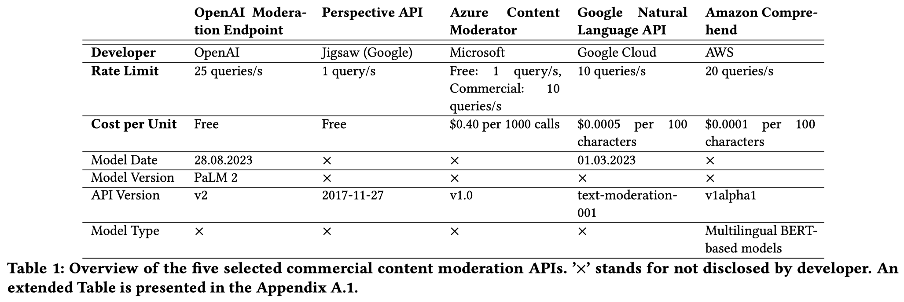
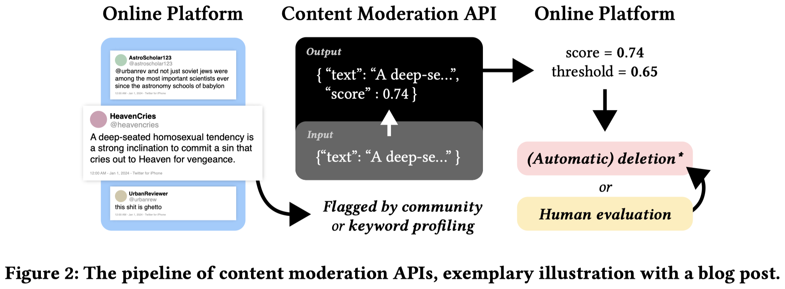
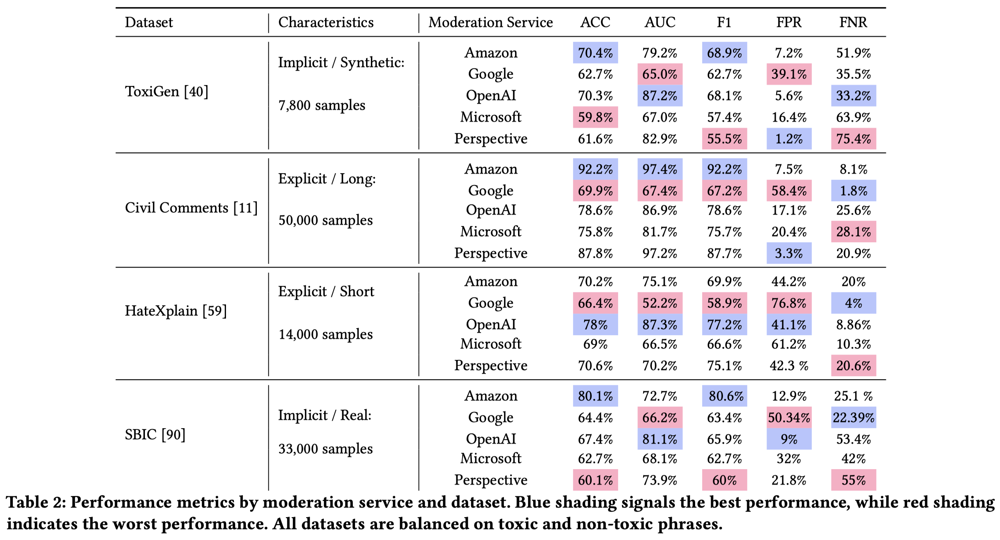
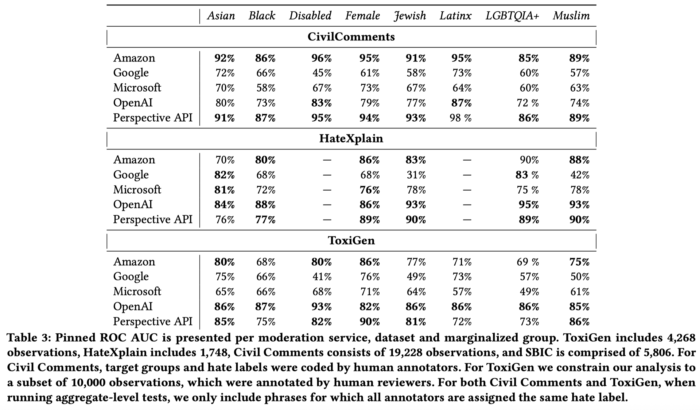
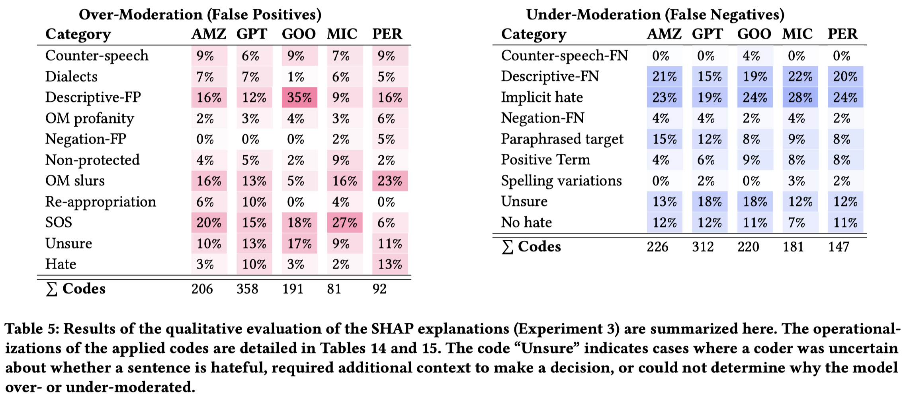
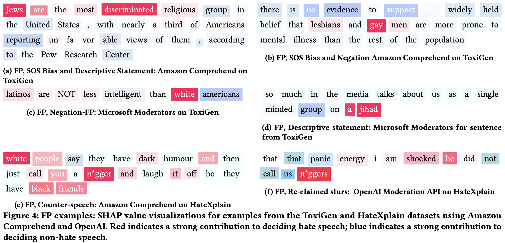

```{css, echo=FALSE} 
@media print { # print out incremental slides; see https://stackoverflow.com/questions/56373198/get-xaringan-incremental-animations-to-print-to-pdf/56374619#56374619
  .has-continuation {
    display: block !important;
  }
}
```

```{r setup, include=FALSE}
# figures formatting setup
options(htmltools.dir.version = FALSE)
library(knitr)
opts_chunk$set(
  prompt = T,
  fig.align="center", #fig.width=6, fig.height=4.5, 
  # out.width="748px", #out.length="520.75px",
  dpi=300, #fig.path='Figs/',
  cache=T, #echo=F, warning=F, message=F
  engine.opts = list(bash = "-l")
  )

## Next hook based on this SO answer: https://stackoverflow.com/a/39025054
knit_hooks$set(
  prompt = function(before, options, envir) {
    options(
      prompt = if (options$engine %in% c('sh','bash')) '$ ' else 'R> ',
      continue = if (options$engine %in% c('sh','bash')) '$ ' else '+ '
      )
})

library(tidyverse)
library(hrbrthemes)
library(fontawesome)
```

<style>

li {
  margin-bottom: 10px;
}

ul {
  text-indent: -1.5em;
  list-style: none;
}

ul li::before {
  content: "";
  background: url('megaphone.png') no-repeat center;
  background-size: contain;
  width: 20px;
  height: 20px;
  flex-shrink: 0; /* Prevents image from resizing */
  display: inline-block;
  margin-right: 10px;
  position: relative;
  top: 0px; /* Moves image slightly down */
}
</style>


# The struggle over content moderation online

.pull-left[

- Public discourse is increasingly online — hate and toxic speech more visible than ever
- Platforms moderate content opaquely, often without oversight ([Gillespie 2018](https://yalebooks.yale.edu/book/9780300261431/custodians-of-the-internet/))
- Content moderation with commercial services is **massive** (e.g., 500m requests per day to JigSaw's Perspective API in 2021; 200m weekly users of OpenAI's Moderation API)
- **Content Moderation APIs** by Google, Microsoft, Amazon, OpenAI, and others are supposedly trained on human labeled data but produce lots of questionable decisions ([Hartmann et al. 2025](https://arxiv.org/pdf/2503.01623); FPR/FNR up to 75%, ACC as low as 60% in balanced toxic/non-toxic samples) 
]

.pull-right[
<div align="center">

</div>
]


---

<br>
<div align="center">

</div>

---

<br>
<div align="center">

</div>

---

<div align="center">

</div>

---

<div align="center">

</div>

---

<br>
<div align="center">

</div>

---

<br>
<div align="center">

</div>


