class: inverse, center, middle


```{css, echo=FALSE} 
@media print { # print out incremental slides; see https://stackoverflow.com/questions/56373198/get-xaringan-incremental-animations-to-print-to-pdf/56374619#56374619
  .has-continuation {
    display: block !important;
  }
}
```

```{r setup, include=FALSE}
# figures formatting setup
options(htmltools.dir.version = FALSE)
library(knitr)
opts_chunk$set(
  prompt = T,
  fig.align="center", #fig.width=6, fig.height=4.5, 
  # out.width="748px", #out.length="520.75px",
  dpi=300, #fig.path='Figs/',
  cache=T, #echo=F, warning=F, message=F
  engine.opts = list(bash = "-l")
  )

## Next hook based on this SO answer: https://stackoverflow.com/a/39025054
knit_hooks$set(
  prompt = function(before, options, envir) {
    options(
      prompt = if (options$engine %in% c('sh','bash')) '$ ' else 'R> ',
      continue = if (options$engine %in% c('sh','bash')) '$ ' else '+ '
      )
})

library(tidyverse)
library(hrbrthemes)
library(fontawesome)
```

<style>

li {
  margin-bottom: 10px;
}

ul {
  text-indent: -1.5em;
  list-style: none;
}

ul li::before {
  content: "";
  background: url('megaphone.png') no-repeat center;
  background-size: contain;
  width: 20px;
  height: 20px;
  flex-shrink: 0; /* Prevents image from resizing */
  display: inline-block;
  margin-right: 10px;
  position: relative;
  top: 0px; /* Moves image slightly down */
}
</style>


# Motivation
<html><div style='float:left'></div><hr color='#EB811B' size=1px style="width:1000px; margin:auto;"/></html>


---
# Content moderation is big and... bad?

.pull-left[

- Platforms moderate content opaquely, often without oversight ([Gillespie 2018](https://yalebooks.yale.edu/book/9780300261431/custodians-of-the-internet/))
- Content moderation with commercial services is **massive** (e.g., 500m requests per day to JigSaw's Perspective API in 2021; 200m weekly users of OpenAI's Moderation API)
- **Content Moderation APIs** by Google, Microsoft, Amazon, OpenAI, and others are supposedly trained on human labeled data but produce lots of questionable decisions ([Hartmann et al. 2025](https://arxiv.org/pdf/2503.01623); FPR/FNR up to 75%, ACC as low as 60% in balanced toxic/non-toxic samples) 
]

.pull-right[
<div align="center">

</div>
]

---
# Why hate speech moderation at scale is so challenging

.pull-left-small2[
## It's a hard problem 

- **Volume and velocity of content**  
  - Billions of posts per day  
  - Error amplification at scale
- **Adversarial users**  
  - Coded language, meme shifts  
  - Evasion of detection systems
- **Context is everything**  
  - Meaning depends on intent  
  - Hard for AI to judge nuance
- **Legal and reputational constraints**  
  - Balance free speech vs harm  
  - Laws differ across countries  
]

--

.pull-right-wide2[
## And we might not even agree on what the problem is...

- **The fundamental subjectivity of hate speech**  
  - Likely varies by culture, context of speech, and individual prefs
  - [Why it's impossible to agree on what's allowed](https://danluu.com/impossible-agree/) (Dan Luu) and the ["No vehicles in the park" rule](https://novehiclesinthepark.com/)
  
]


---
# Why hate speech moderation at scale is so challenging

.pull-left-small2[
## It's a hard problem 

- **Volume and velocity of content**  
  - Billions of posts per day  
  - Error amplification at scale
- **Adversarial users**  
  - Coded language, meme shifts  
  - Evasion of detection systems
- **Context is everything**  
  - Meaning depends on intent  
  - Hard for AI to judge nuance
- **Legal and reputational constraints**  
  - Balance free speech vs harm  
  - Laws differ across countries  
]

.pull-right-wide2[
## And we might not even agree on what the problem is...

- **The fundamental subjectivity of hate speech**  
  - Likely varies by culture, context of speech, and individual prefs
  - [Why it's impossible to agree on what's allowed](https://danluu.com/impossible-agree/) (Dan Luu) and the ["No vehicles in the park" rule](https://novehiclesinthepark.com/)
  
## ... and how it should be tackled

<div align="center">
<br>

</div>
]


---
# Evidence on variation in hate speech moderation preferences

- Support for moderation of severe hate speech (threats, violence) ([Pradel et al. 2024](https://www.cambridge.org/core/services/aop-cambridge-core/content/view/405333D7072585903E81BEF1729378F8/S000305542300134Xa.pdf/div-class-title-toxic-speech-and-limited-demand-for-content-moderation-on-social-media-div.pdf), [Munzert et al. 2025](https://academic.oup.com/pnasnexus/article/4/2/pgaf032/8010228), [Rasmussen 2022](https://osf.io/preprints/psyarxiv/j4nuc))
- Persistent gender gap in content moderation preferences ([Pradel and Theocharis 2024](https://www.researchgate.net/profile/Franziska-Pradel/publication/385196410_Gender_Differences_in_Demanding_Moderation/links/6723936cdb208342dee0f484/Gender-Differences-in-Demanding-Moderation.pdf); [Munzert et al. 2025](https://academic.oup.com/pnasnexus/article/4/2/pgaf032/8010228))
- Ideological differences in tolerance for hate speech ([Munzert et al. 2025](https://academic.oup.com/pnasnexus/article/4/2/pgaf032/8010228))
- Partisan norms and identity signaling drive sanctioning preferences ([Ahn et al. 2024](https://doi.org/10.1093/pnasnexus/pgae534), [Dias et al. 2024](https://doi.org/10.1086/733004))

<div align="center">


</div>


---
# Research questions

.pull-left[
<br><br><br><br>

- How do **features of speech and speech context** shape preferences for content moderation?
- How do hate speech perceptions and moderation preferences **vary across countries**?
- How do **individual characteristics** shape preferences for content moderation, and do they **interact with the content and context of speech**?
]

.pull-right[
<br><br><br>
<div align="center">

</div>
]


---
# Pre-registered hypotheses

## Myside bias

**H1:** Respondents who **agree (vs. disagree) with the issue position of the target** are more likely to
- perceive messages as being hate speech and offensive speech and 
- prefer platform, legal, and employer action against the message/sender.


## Identity-based in-group/out-group bias

**H2:** Respondents who **share gender or ethnicity with the target** are more likely to
- perceive messages as being hate speech and offensive speech and 
- prefer platform, legal, and employer action against the message/sender.

**H3:** Respondents who **share gender or ethnicity with the sender** are less likely to
- perceive messages as being hate speech and offensive speech and 
- prefer platform, legal, and employer action against the message/sender.


---
class: inverse, center, middle

# Setup
<html><div style='float:left'></div><hr color='#EB811B' size=1px style="width:1000px; margin:auto;"/></html>


---
# Data collection

.pull-left[
- Online survey fielded in 11 countries
- Recruitment via FB/Instagram ads
- ~18.5k completed interviews
- [Pre-registered at OSF](https://osf.io/2ec8m)

<br>
<div align="center">
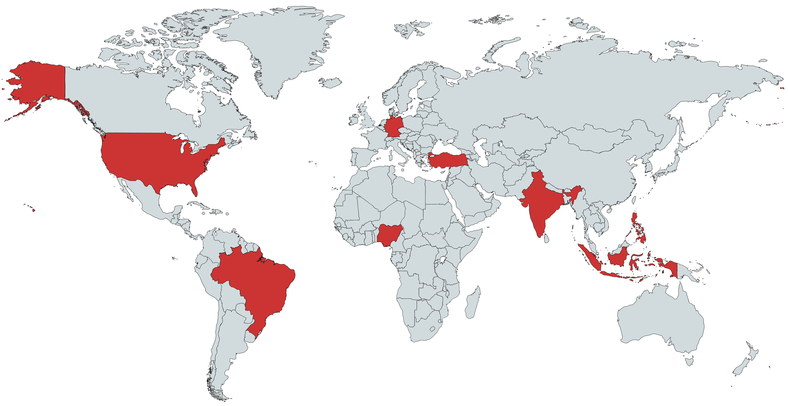
</div>
]

.pull-right[
<br>
<div align="center">


</div>
]


---
# Experimental setup


<div align="center">

</div>


---
# Vignette attributes and levels

.pull-left[

<br>
<br>

<table border="1" cellpadding="6" cellspacing="0" style="border-collapse: collapse; font-size: 16px;">
  <thead>
    <tr>
      <th>Attribute</th>
      <th>Levels</th>
    </tr>
  </thead>
  <tbody>
    <tr>
      <td>① Topic</td>
      <td>14 topics (feminism, religiosity, partisanship, ...)</td>
    </tr>
    <tr>
      <td>② Target stance</td>
      <td>left, right</td>
    </tr>
    <tr>
      <td>③ Message category</td>
      <td>opinion, meme, mocking, insult, threat</td>
    </tr>
    <tr>
      <td>④ Message severity</td>
      <td>moderate, extreme</td>
    </tr>
    <tr>
      <td>⑤ Message scope</td>
      <td>personal, group</td>
    </tr>
    <tr>
      <td>⑥ Target's identity</td>
      <td>white/non-white, female/male</td>
    </tr>
    <tr>
      <td>⑦ Sender's identity</td>
      <td>white/non-white, female/male</td>
    </tr>
  </tbody>
</table>

]


.pull-right[
<div align="center">

</div>
]


---
# Topic overview

<div align="center">
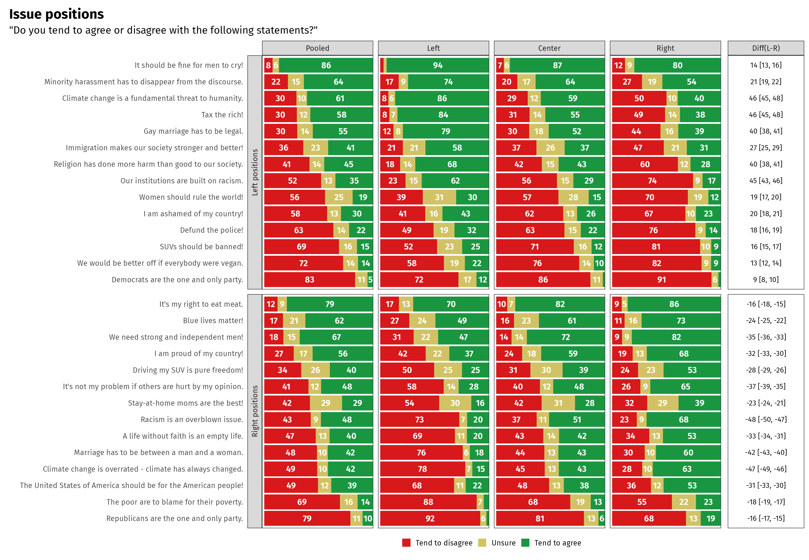
</div>


---
# Message scheme

<style type="text/css">
.tg  {border-collapse:collapse;border-spacing:0;}
.tg td{border-color:black;border-style:solid;border-width:1px;font-family:Fira Sans, sans-serif;font-size:14px;
  overflow:hidden;padding:10px 5px;word-break:normal;}
.tg th{border-color:black;border-style:solid;border-width:1px;font-family:Fira Sans, sans-serif;font-size:14px;
  font-weight:normal;overflow:hidden;padding:10px 5px;word-break:normal;}
.tg .tg-cly1{text-align:left;vertical-align:middle}
.tg .tg-yla0{font-weight:bold;text-align:left;vertical-align:middle}
.tg .tg-7zrl{text-align:left;vertical-align:middle}
.tg .tg-xzsy{font-style:italic;text-align:left;vertical-align:middle}
</style>
<table class="tg"><thead>
  <tr>
    <th class="tg-yla0">Message category</th>
    <th class="tg-yla0" colspan="2">Message severity</th>
    <th class="tg-yla0">Example (targeting left)</th>
    <th class="tg-yla0">Example (targeting right)</th>
  </tr></thead>
<tbody>
  <tr>
    <td class="tg-cly1" rowspan="2">Opinion/Policy position</td>
    <td class="tg-cly1">Moderate</td>
    <td class="tg-cly1">Social norm</td>
    <td class="tg-xzsy">We should only welcome legal immigrants</td>
    <td class="tg-xzsy">Xenophobes shouldn't be tolerated on the internet</td>
  </tr>
  <tr>
    <td class="tg-cly1">Extreme</td>
    <td class="tg-cly1">Law, ban, state- enforcement of some kind</td>
    <td class="tg-xzsy">The government should deport more immigrants!</td>
    <td class="tg-xzsy">Xenophobes should lose their citizenship and be thrown out of   the country!</td>
  </tr>
  <tr>
    <td class="tg-cly1" rowspan="2">Incivility/insult</td>
    <td class="tg-cly1">Moderate</td>
    <td class="tg-cly1">Denigrating, dismissive</td>
    <td class="tg-xzsy">Most immigrants are uneducated. </td>
    <td class="tg-xzsy">Xenophobes are pathetic, bigoted losers. </td>
  </tr>
  <tr>
    <td class="tg-cly1">Extreme</td>
    <td class="tg-cly1">Offensive, often a slur</td>
    <td class="tg-xzsy">Immigrants are dirty rats!</td>
    <td class="tg-xzsy">Xenophobes are a bunch of flag fuckers!</td>
  </tr>
  <tr>
    <td class="tg-cly1" rowspan="2">Threat/Violence</td>
    <td class="tg-cly1">Moderate</td>
    <td class="tg-cly1">Threatening or wishing some kind of physical harm, on the level of a hard punch</td>
    <td class="tg-xzsy">Immigrants should be punched in the face. </td>
    <td class="tg-xzsy">Xenophobes should be punched in the face. </td>
  </tr>
  <tr>
    <td class="tg-cly1">Extreme</td>
    <td class="tg-cly1">Threatening or wishing lethal violence</td>
    <td class="tg-xzsy">Immigrants should all be exterminated like vermin!</td>
    <td class="tg-xzsy">Xenophobes should be taken out and shot!</td>
  </tr>
  <tr>
    <td class="tg-cly1" rowspan="2">Mocking/Sarcasm</td>
    <td class="tg-cly1">Moderate, verbal</td>
    <td class="tg-cly1">Undermining the target by making fun of the message or target group, being ironic</td>
    <td class="tg-xzsy">Oh yeah, cannot imagine our society without its drug dealers.   Lol</td>
    <td class="tg-xzsy">Oh yeah, people other than native Americans don't have a place   here! Lol</td>
  </tr>
  <tr>
    <td class="tg-cly1">Moderate, meme</td>
    <td class="tg-cly1">Mocking/making fun of the target</td>
    <td class="tg-7zrl"></td>
    <td class="tg-7zrl"></td>
  </tr>
</tbody></table>


---
# The memes

.pull-left[
<br><br>
<div align="center">

</div>
]

.pull-left[
<br>
<div align="center">

</div>
]


---
# All the (U.S.) memes

<div style="margin-left: -2em; margin-right: -2em; padding-left: 0; padding-right: 0;">
<div style="display: flex; flex-wrap: wrap; gap: 5px; justify-content: center; max-height: 75vh; overflow-y: hidden;">

  
  
  
  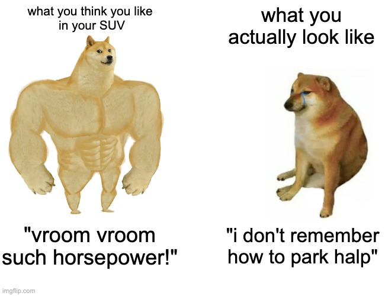
  
  
  
  
  
  
  
  
  
  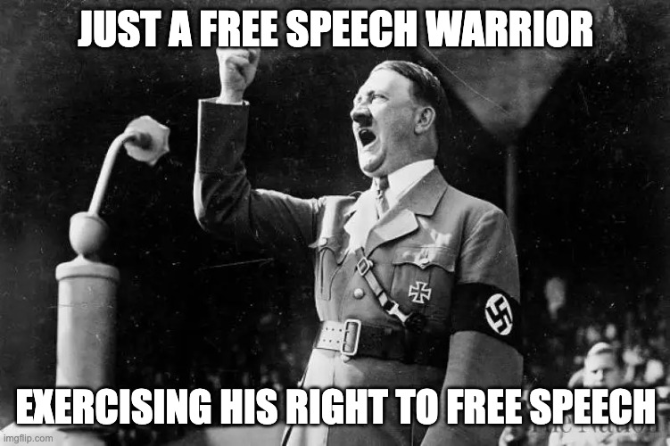
  
  
  
  
  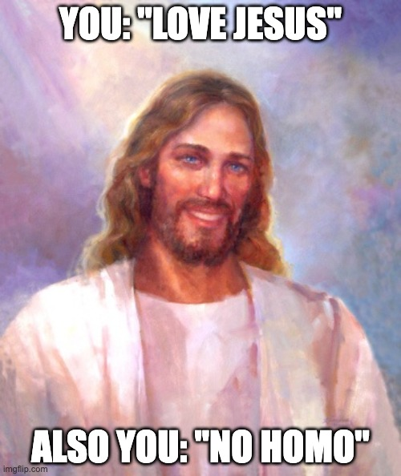
  
  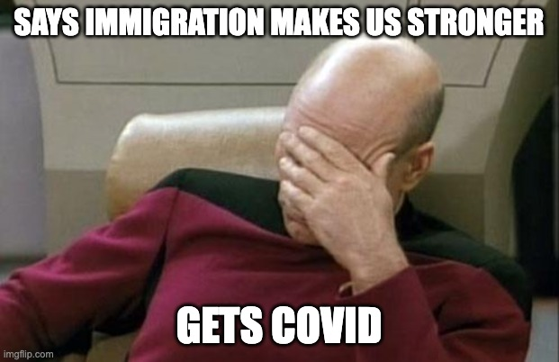
  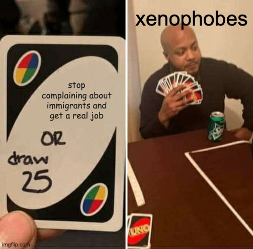
  
  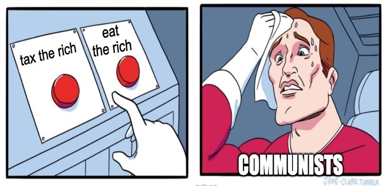
  
  
  
  
  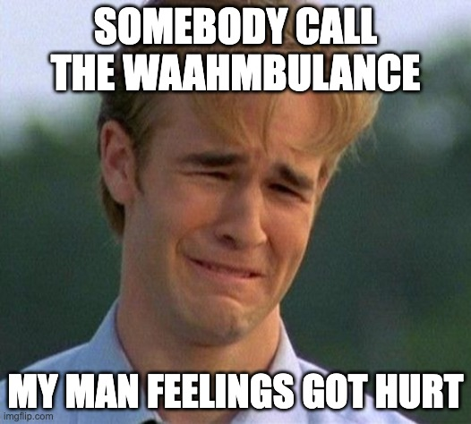
  
  
  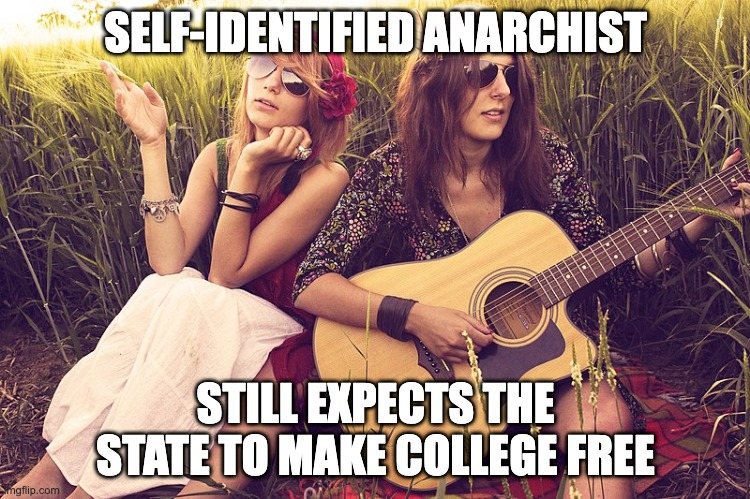
  
  
  
  
  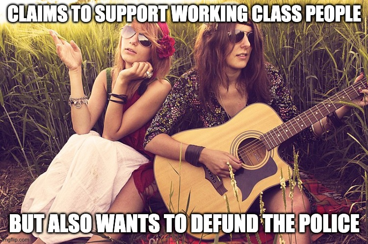
  
  
  
  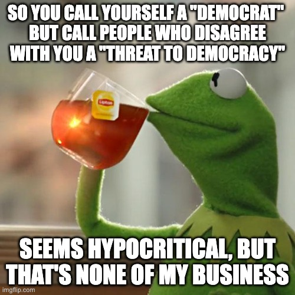
  
  
  
  
  
  
  
  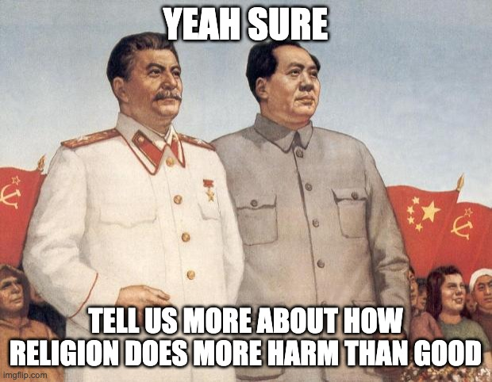
  
  
  
  
  
  
</div>
</div>


---
# Elicitation of preferences

.pull-left[
<div align="center">

</div>
]

.pull-right[

<div align="center">
<br><br>
<a href="https://digital-citizen-lab.com/hate-survey-sample" style="font-size: 1.5em; font-weight: bold;">https://digital-citizen-lab.com/</a><br>
<a href="https://digital-citizen-lab.com/hate-survey-sample" style="font-size: 1.5em; font-weight: bold;">hate-survey-sample</a>
<br><br>

</div>
]


---
class: inverse, center, middle

# Results
<html><div style='float:left'></div><hr color='#EB811B' size=1px style="width:1000px; margin:auto;"/></html>


---
# More results: please go to

<div align="center">
<br><br>
<a href="https://digital-citizen-lab.com/hate-speech-study" style="font-size: 1.5em; font-weight: bold;">https://digital-citizen-lab.com/</a><br>
<a href="https://digital-citizen-lab.com/hate-speech-study" style="font-size: 1.5em; font-weight: bold;">hate-speech-study</a>
<br><br>

</div>


---
# Perceptions vs. actions

<div style="margin-left: -2em; margin-right: -2em; padding-left: 0; padding-right: 0;">
<div align="center">


</div>
</div>


---
# Messages most often flagged as hate speech

<div style="margin-left: -2em; margin-right: -2em; padding-left: 0; padding-right: 0;">
<div align="center">

</div>
</div>


---
# Effect of non-alignment on issue stance with target (H1)

<div style="margin-left: -2em; margin-right: -2em; padding-left: 0; padding-right: 0;">
<div align="center">

</div>
</div>


---
# Effect of non-alignment on gender/ethnicity with target (H2)

<div style="margin-left: -2em; margin-right: -2em; padding-left: 0; padding-right: 0;">
<div align="center">

</div>
</div>


---
# Effect of non-alignment on gender/ethnicity with sender (H3)

<div style="margin-left: -2em; margin-right: -2em; padding-left: 0; padding-right: 0;">
<div align="center">

</div>
</div>


---
# Agreement rates across speech types and subgroups

<div style="margin-left: -2em; margin-right: -2em; padding-left: 0; padding-right: 0;">
<div align="center">

</div>
</div>


---
class: inverse, center, middle

# Take-aways
<html><div style='float:left'></div><hr color='#EB811B' size=1px style="width:1000px; margin:auto;"/></html>


---
# Implications

.pull-left[
- **Reconsider the gold standard**  
  Treating human judgments as a gold standard for training AI models is problematic. 
- **Take cultural contexts into account**  
  Any moderation approach that does not consider local and regional speech norms is likely to produce decisions that are at odds with human preferences on the ground.
- **There are hard and really hard cases. Focus on the just hard ones first?**  
  As biases induced by respondent characteristics seem to be less pronounced for harder forms of hate speech, focusing on those cases might be a good starting point for training AI models.
]

.pull-right[
<div align="center">

</div>
]


