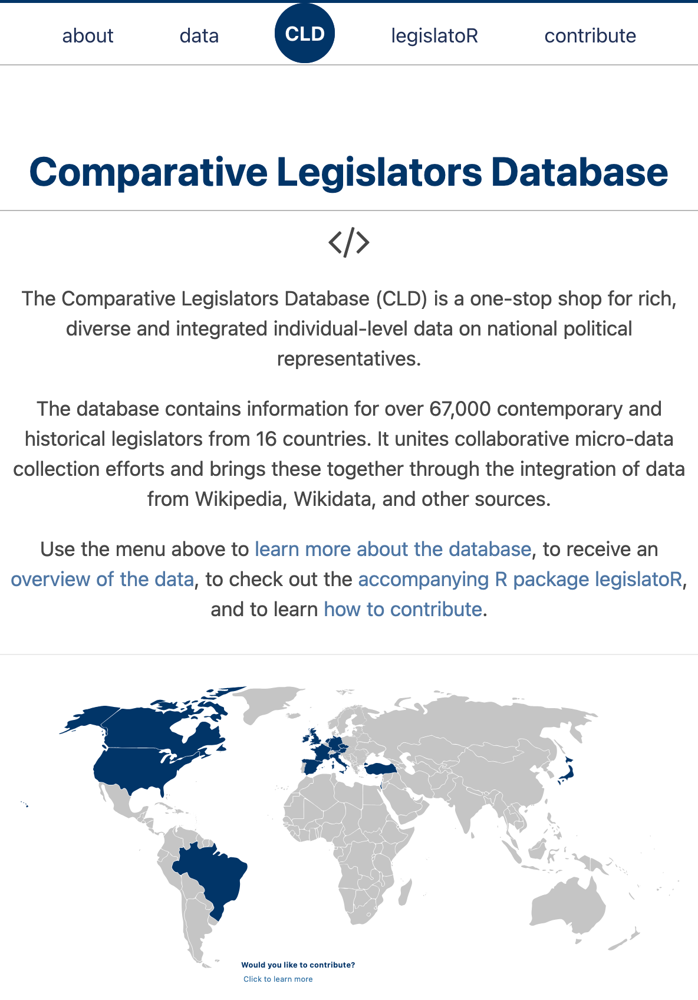

class: inverse, center, middle


```{css, echo=FALSE} 
@media print { # print out incremental slides; see https://stackoverflow.com/questions/56373198/get-xaringan-incremental-animations-to-print-to-pdf/56374619#56374619
  .has-continuation {
    display: block !important;
  }
}
```

```{r setup, include=FALSE}
# figures formatting setup
options(htmltools.dir.version = FALSE)
library(knitr)
opts_chunk$set(
  prompt = T,
  fig.align="center", #fig.width=6, fig.height=4.5, 
  # out.width="748px", #out.length="520.75px",
  dpi=300, #fig.path='Figs/',
  cache=T, #echo=F, warning=F, message=F
  engine.opts = list(bash = "-l")
  )

## Next hook based on this SO answer: https://stackoverflow.com/a/39025054
knit_hooks$set(
  prompt = function(before, options, envir) {
    options(
      prompt = if (options$engine %in% c('sh','bash')) '$ ' else 'R> ',
      continue = if (options$engine %in% c('sh','bash')) '$ ' else '+ '
      )
})

library(tidyverse)
library(hrbrthemes)
library(fontawesome)
library(lubridate)
library(urltools)
library(magrittr)
library(scales)
library(rnaturalearth)
library(rnaturalearthdata)
library(janitor)

# load data
load("input/pulse_weburls_jul2017_feb2019_df_sample_small.RData")
dat <- pulse_sample_random
dat$domain <- str_replace(dat$domain, "^www.", "")
dat$date <- date(dat$used_at)
dat %<>% group_by(date)  %>% 
  filter(n() > 100) %>% 
  filter(!is.na(date)) %>% 
  filter(!(provider == "realitymine" & date < "2018-01-01")) %>% 
  ungroup()
dat$provider <- factor(dat$provider, levels = c("wakoopa", "realitymine"))
```

<link href="https://fonts.googleapis.com/css2?family=Nothing+You+Could+Do:wght@400;700&display=swap" rel="stylesheet">

<style>
ul {
  list-style: none;
  padding-left: 0;
  margin-top: 1.25rem; /* increase as needed */
}

/* No top margin for indented (nested) lists */
ul ul,
ul ol {
  margin-top: 0;
}

ul li { position: relative; padding-left: 30px; }

ul li::before {
  content: "";
  position: absolute;
  left: 0;
  top: .25em;         /* aligns with first line */
  width: 20px;
  height: 20px;
  background: url('hand-bullet.png') no-repeat center / contain;
}
</style>


# From the past of democracy research ...
<html><div style='float:left'></div><hr color='#EB811B' size=1px style="width:1000px; margin:auto;"/></html>


---

<div align="center">

</div>


---
# Record of roll call votes in the Weimar Republic (1920-1932)

.pull-left[
<div align="center">

</div>
]

.pull-right[
<div align="center">


</div>

<div align="center">

</div>
]


---
# Tracing back the data

.pull-left[
## Can AI help?

<div align="center">


</div>
]

--

.pull-right[
## Tracing down the raw data

<br>
<div align="center">
  <video
    style="width:95%; height:auto; margin-top:5px;"
    autoplay
    loop
    muted
    playsinline
    preload="metadata"
  >
    <source src="pics/weimar-roll-calls-recherche.mp4" type="video/mp4">
    <!-- Optional alt format -->
    <!-- <source src="pics/weimar-roll-calls-recherche.webm" type="video/webm"> -->
    Your browser doesn’t support HTML5 video.
  </video>
</div>
]


---
class: inverse, center, middle

# Observations from present-day democracy research
<html><div style='float:left'></div><hr color='#EB811B' size=1px style="width:1000px; margin:auto;"/></html>

<br>
<div style="text-align:center;">
  <span style="color:#fff; font-size:2rem; font-weight:700;">
    Case I: Archiving online behavioral data
  </span>
</div>


---
# Project "Media Exposure and Opinion Formation" (MEOF)

.pull-left-wide[
## Project goals and data

- Study of the effects of online partisan media exposure on political attitudes and behaviors
- Opt-in web panel in USA and Germany, operated by YouGov
- About 1,500 respondents each in multiple waves, 2018-2020
- Browser and smartphone tracking via passive metering software


<div align="center" style="height:500px">
<br>


</div>

]

.pull-right-small[

<div align="center">
<br><br><br>


</div>
]


---
# MEOF: Archiving the data with GESIS

.pull-left[

## Joint data archival project

- Joint data archiving project with GESIS 
- Timeline: Fall 2021 - Summer 2022
- Archival of MEOF survey and tracking data for scientific use
- Development of an anonymization and publication concept for linked survey and tracking data

## Why this matters

- <b style="color:#cc0065">Reproducibility</b> of findings
- <b style="color:#cc0065">Enabling new research</b> (but: knowledge decay)
- <b style="color:#cc0065">Mitigating inequalities</b> in the community. These data are costly to collect!
- <b style="color:#cc0065">Historical value</b>: Are those data here to stay in an app-based world?
]

.pull-right[
<div align="center">


</div>
]


---
# Challenges for publishing linked survey and tracking data

.pull-left[

## Practical challenges

- <b style="color:#cc0065">Data handling</b> for repositories and users (i.e., storage infrastructure, computational power)
- Lack of <b style="color:#cc0065">standards</b> (i.e., collection, curation, and documentation)

## Legal and ethical challenges

- Both the survey and the tracking data should be considered <b style="color:#cc0065">private information</b> (in contrast to, e.g., some Twitter data)
- <b style="color:#cc0065">Identifiability</b> in one of the sources can <b style="color:#cc0065">compromise</b> the security/privacy of the other
- GDPR establishes <b style="color:#cc0065">special categories</b> (info on racial or ethnic origin, political opinions, or religious or philosophical beliefs). The research participant must give “explicit consent”
]

.pull-right[
<div align="center">
<br><br>

</div>
]

---
# Compromising anonymity I: geo-information

```{r}
# parse Google requests
google_maps_df <- filter(dat, str_detect(url, "/maps"))

# how much of the URLs are Google Maps URLs?
nrow(google_maps_df)
nrow(google_maps_df)/nrow(dat) # about 0.6%

# extract coordinates
google_maps_df$coord_raw <- str_extract(google_maps_df$url, 
                                        "@[-[:digit:]]{1,4}\\.[:digit:]+,[-[:digit:]]{1,4}\\.[:digit:]+")
google_maps_df$lat <-  str_extract(google_maps_df$coord_raw,
                                   "[-[:digit:]]{1,4}\\.[:digit:]+") %>% as.numeric()
google_maps_df$lon <-  str_extract(google_maps_df$coord_raw,
                                   "[-[:digit:]]{1,4}\\.[:digit:]+$") %>% as.numeric()
```


---
# Compromising anonymity I: geo-information

.pull-left[
```{r, echo = FALSE, warning=FALSE, message=FALSE}
# define German boundaries
lat1 <- 47; lat2 <- 55.5 ; lon1 <- 5.5; lon2 <- 15.5

# plot requested coordinates, world map
world <- ne_countries(scale = "medium", returnclass = "sf")
ggplot(data = world) +
    geom_sf() +
    geom_point(data = google_maps_df, aes(x = lon, y = lat), size = .5, 
        shape = 20, color = "red") +
    theme_bw()
    coord_sf(xlim = c(-88, -78), ylim = c(24.5, 33), expand = FALSE)
```
]

.pull-right[
```{r, echo = FALSE, warning=FALSE, message = FALSE}
# plot requested coordinates, Germany map
ggplot(data = world) +
    geom_sf() +
    geom_point(data = google_maps_df, aes(x = lon, y = lat), size = .5, 
        shape = 20, color = "red") +
    theme_bw() + 
    coord_sf(xlim = c(lon1, lon2), ylim = c(lat1, lat2), expand = FALSE)
```
]


---
# Compromising anonymity I: geo-information

```{r}
# parse ebay sites
ebay_df <- filter(dat, str_detect(url, "ebay"))

# plz
ebay_plz <- ebay_df %>% 
  filter(domain == "ebay-kleinanzeigen.de", str_detect(path, "^s\\-[:digit:]{5}")) %>%
  pull(path) %>% 
  str_extract("[:digit:]{5}")
length(ebay_plz)
ebay_plz[1:20]
```


---
# Compromising anonymity II: social media profiles

.pull-left[
```{r}
# parse social media sites
socialmedia_df <- filter(dat, 
                         str_detect(url, "facebook|instagram|twitter|youtube"))

# popular pages
tabyl(socialmedia_df$domain) %>% 
  arrange(desc(n)) %>% 
  head(10)
```
]

.pull-right[
```{r}
# identify facebook pages
facebook_pages <- socialmedia_df %>% 
  filter(domain == "facebook.com", 
         str_detect(path, "^[[:alnum:]\\.]+")) %>% 
  pull(path)
tabyl(facebook_pages) %>% 
  arrange(desc(n)) %>% 
  head(10)
```
]


---
# Compromising anonymity III: id attributes

Sometimes the `id` parameter together with a value in the URL query string can entail a person-specific, time-persistent identifier. The `id` parameter is widespread in our data. The fraction of URLs containing `"id="` is:

```{r}
str_detect(pulse_sample_random$url, regex("id=", ignore_case = TRUE)) %>% mean(na.rm = TRUE)
```

Some examples of potentially compromising URLs involving `id`s:

- `flirty-chat.eu/a_market/profile.php?id=915`
- `securebanking.hanseaticbank.de/onlinebanking-hb?windowId=e40b4a5d-ed34-4191`
- `date4sex.com/index.php?event=showuserprofile&FlirtUserID=120628489196`
- `fremdgehen69.com/index.php?event=showuserprofile&FlirtUserID=893300246841`
- `navigator.web.de/mail?sid=6879ade5373dc9066cb4cbc6be472fba1db3bfea4`
- `dkr1.ssisurveys.com/projects/end?rst=3&psid=3iKELhWPumlquySd2B96sg`

Of course, the `id` parameter is just one of many examples of URL parts unique to a user. If these parts are persistent over time, the problem becomes more problematic.


---
# MEOF: Making the data publishable

.pull-left[
## Thresholding/winsorizing

- Most privacy-compromising information in the domains is in the long tail: domains that are problematic because only one (or a few) participants use it. 
- Use thresholds to exclude obs that (1) are visited by very few unique participants and/or (2) receive few overall hits in the sample.

<div align="center">

</div>
]

--

.pull-right[
## Differential levels of access

- A set of <b style="color:#cc0065">public use files</b> containing highly aggregated data (publicly accessible without restrictions)
- An <b style="color:#cc0065">academic use file</b> containing individual-level, filtered <b style="color:#cc0065">domain-level data</b> that can be matched to the survey data (accessible online to registered researchers)
- An academic use file containing individual-level, preprocessed full URL data restricted to a <b style="color:#cc0065">predefined set of news websites</b> (accessible online to registered researchers)
- A minimally reduced version of the original full URL dataset as a <b style="color:#cc0065">restricted-use file</b> (only accessible within a secure environment physically located at the data archive)
]


---
# MEOF: Dissemination to the community

.pull-left[
<div align="center">

</div>
]

.pull-right[
<div align="center">

</div>
]


---
class: inverse, center, middle

# Observations from present-day democracy research
<html><div style='float:left'></div><hr color='#EB811B' size=1px style="width:1000px; margin:auto;"/></html>

<br>
<div style="text-align:center;">
  <span style="color:#fff; font-size:2rem; font-weight:700;">
    Case II: The Comparative Legislators Database
  </span>
</div>


---
background-image: url("pics/mps-bt-2025.png")
background-size: cover
background-color: #000000

---
# The Comparative Legislators Database (CLD)

.pull-left[
## Mission statement

A <b style="color:#cc0065">central hub</b> for individual-level data on nationally elected legislators in a wide range of countries. The database is designed to <b style="color:#cc0065">facilitate comparative research on the political behavior of legislators</b> across countries and over time.

## Why another dataset on political elites?

- Political elites are central actors in democracies
- Status quo: recurrent data collection is inefficient
- Previous data collection efforts limited in scope and coverage
- Gerring et al., 2019: "There is no centralized dataset for political elites."
]

.pull-right[
## Previous use of MP data

- Survey of articles in APSR, AJPS, JOP, BJPS, LSQ
- Search period: 2009–2018
- Query: '(MP OR legislator) AND data' [535 hits]
- After screening: 209 articles with use of individual-level data of members of national-level legislative bodies

<div align="center">

</div>
]


---
# CLD: The data collection pipeline

<div align="center">

</div>


---
# CLD: Dissemination for the community

.pull-left-small2[
<div align="center">

</div>

<br>
<div align="center">

</div>
]

.pull-right-small2[
<div align="center">

</div>
]

.pull-right-small2[
<div align="center">

</div>
]


---
# CLD: Access and integration

.pull-left-wide[
## The `legislatoR` package

`legislatoR` is a package for the software environment R that facilitates database access. The package is available through CRAN and GitHub:

```{r, eval=FALSE}
install.packages("legislatoR")
devtools::install_github("saschagobel/legislatoR")
```

## Integration

The CLD is designed to be easily integrated with other datasets, including:

- ParlSpeech (Rauh/Schwalbach)
- BTVote (Bergmann et al.)
- Reelection prospects (Stoffel/Sieberer)
- Parliamentary Speeches in Ireland (Herzog/Jankin)
- ParlScot (Brab/Fraser)
- Voteview (Lewis et al.)
- Congressional Bills Project (Adler/Wilkerson)
]

.pull-right-small[
<div align="center">
<br>

</div>
]


---
class: inverse, center, middle

# Observations from present-day democracy research
<html><div style='float:left'></div><hr color='#EB811B' size=1px style="width:1000px; margin:auto;"/></html>

<br>
<div style="text-align:center;">
  <span style="color:#fff; font-size:2rem; font-weight:700;">
    Case III: Building an election forecasting and research infrastructure
  </span>
</div>


---
# The zweitstimme.org project

.pull-left[
<div align="center">

</div>
]

.pull-right[
<br><br>
<div align="center">

</div>
]


---
# The zweitstimme.org project

.pull-left-vsmall[
## National-level forecasting

<ul>
  <li>"Pooling the polls"</li>
  <li>Published polls, election results</li>
  <li>Implemented since 2017</li>
</ul>

<br><br><br>
<div align="center">

</div>
]

.pull-left-vsmall[
## Local forecasting

<ul>
  <li>Constituency models</li>
  <li>Integrates constituency and candidate data</li>
  <li>Implemented since 2017</li>
</ul>

<script>
  setInterval(function() {
    var text = document.getElementById("blink-text");
    text.style.visibility = (text.style.visibility == "hidden" ? "visible" : "hidden");
  }, 1000);
</script>

<br><br>
<div align="center">

</div>
]

.pull-left-vsmall[
## Citizen + expert forecasts

<ul>
  <li>New in 2025: 37k respondents Jan–Feb 2025</li>
  <li>Online recruitment, constituency coverage</li>
  <li>Citizen forecasting</li>
</ul>

<br><br>
<div align="center">

</div>
]

.pull-left-vsmall[
## Experiments

<ul>
  <li>How to communicate polls</li>
  <li>Effects of election forecasts</li>
  <li>Dashboard intervention</li>
</ul>

<br><br><br>
<div align="center">

</div>
]


---
# Building a research infrastructure

.pull-left[

## Data used in the project

- Poll results (federal & state)
- Election results (federal & state)
- Constituencies (federal & state)
- Fundamentals & structural data (federal/state/district)
- Candidates & MPs (federal)
- Election forecasts
- In-house surveys

<div align="center">

</div>
]


.pull-right[

<div align="center">

</div>
]


---
class: inverse, center, middle

# Towards a better future of democracy research
<html><div style='float:left'></div><hr color='#EB811B' size=1px style="width:1000px; margin:auto;"/></html>


---
background-image: url("pics/take-aways-1.png")
background-size: cover
background-color: #000000

.pull-left[
<br>

<div style="text-align:center;">
<span style="font-family:'Nothing You Could Do', bold; font-size:3rem; font-weight:400;">Integrate!</span>
</div>

- Researchers get lost in building fragmented data infrastructures (case in point: me).
- Specialized collection is fine, but fragmented dissemination hinders use.
- Lack of integration blocks comparative research.

<div style="text-align:center;">
<span style="font-family:'Nothing You Could Do', bold; font-size:1.5rem; font-weight:400;">What I'd like MEDem to build towards</span>
</div>

- Incentivization of <b style="color:#cc0065">shared infrastructures</b>
- <b style="color:#cc0065">Toolkits</b> to standardize data collection (measurement and interoperability)
]


---
background-image: url("pics/take-aways-2.png")
background-size: cover
background-color: #000000

.pull-left[
<br>

<div style="text-align:center;">
<span style="font-family:'Nothing You Could Do', bold; font-size:3rem; font-weight:400;">Consolidate!</span>
</div>

- Huge troves of data remain hidden, unarchived, or unusable.
- Valuable research gets lost or overlooked (Weimar data!).
- Even well-documented data (e.g., on Dataverse) isn’t prepared for reuse.

<div style="text-align:center;">
<span style="font-family:'Nothing You Could Do', bold; font-size:1.5rem; font-weight:400;">What I'd like MEDem to build towards</span>
</div>

- <b style="color:#cc0065">Not yet another archive</b> - a search engine alone won’t cut it.
- Actively <b style="color:#cc0065">showcasing data</b>: dataset of the month, hackathons, researcher-in-residence models
]


---
background-image: url("pics/take-aways-3.png")
background-size: cover
background-color: #000000

.pull-left[
<br>

<div style="text-align:center;">
<span style="font-family:'Nothing You Could Do', bold; font-size:3rem; font-weight:400;">Automate!</span>
</div>

- Democracy research faces exploding data (e.g., digital trace data, app-based data, sensor data)
- Also, new methods to analyze these data (e.g., ML, NLP)
- Comprehensive integration only feasible with computer-assisted workflows and automation?

<div style="text-align:center;">
<span style="font-family:'Nothing You Could Do', bold; font-size:1.5rem; font-weight:400;">What I'd like MEDem to build towards</span>
</div>

- <b style="color:#cc0065">ML for harmonization:</b> Automate variable mapping, standardization, and dataset integration.
- <b style="color:#cc0065">ML for discovery:</b> Use machine learning to surface, classify, and recommend hidden datasets.
]


---
<br>

<div style="text-align:center;">
<span style="font-family:'Nothing You Could Do', bold; font-size:2rem; font-weight:400;">Integrate - Consolidate - Automate</span>
</div>
<br>

<div style="text-align:center;">
<span style="font-family:'Nothing You Could Do', bold; font-size:4rem; font-weight:400;">Thank you!</span>

<br><br><br><br>

<b>Simon Munzert</b><br><b>Hertie School, Berlin</b>

<br><br>

<b>Slides at </b><br><a href="https://simonmunzert.com/medem25"<b>simonmunzert.com/medem25</b></a>
</div>


