```{css, echo=FALSE}
@media print {
  .has-continuation { display: block !important; }
}
.title-slide h1 .event { display: block; font-size: 45%; font-weight: 400; color: #bbbbbb; margin-bottom: 14px; line-height: 1.3; }
.title-slide h2:empty { display: none; }
.small { font-size: 80%; line-height: 1.35; }
.tiny { font-size: 65%; color: #777; }
.src { position: absolute; left: 2em; right: 2em; bottom: 12px; font-size: 60%; color: #888; text-align: left; line-height: 1.3; }
.src a { color: #888; text-decoration: underline; text-decoration-style: dotted; }
.section-no { display: block; font-size: 4.5rem; font-weight: 700; color: #ff0000; line-height: 1; margin-top: -40px; margin-bottom: 110px; }
.fig { float: left; width: 70%; margin-top: -8px; }
.fig img { width: 100%; height: auto; }
.figwide { width: 85%; margin: -8px auto 0 auto; }
.figwide img { display: block; width: 80%; height: auto; margin: 0 auto; }
.fig.sq { width: 46%; margin-left: 10%; }
:root { --ta-font: 'Nothing You Could Do', cursive; }   /* take-aways heading font: Caveat | Kalam | Patrick Hand | Architects Daughter | Handlee | Covered By Your Grace */
.notes { position: absolute; right: 0.8em; width: 25%; top: 60%; margin: 0; }
.formula { position: absolute; right: 0.8em; width: 25%; top: 20%; font-size: 85%; line-height: 1.35; }
.formula .mjx-chtml, .formula mjx-container { font-size: 120% !important; }
.notes .ta { font-family: var(--ta-font); font-size: 2rem; font-weight: 600; color: #000; margin: 0 0 4px 0; line-height: 1; }
.notes ul { margin-top: 0; }
.notes li { font-size: 78%; line-height: 1.35; margin-bottom: 10px; }
.jl { float: left; width: 58%; }
.jr { float: right; width: 40%; }
.clips { display: grid; grid-template-columns: 1fr 1fr; gap: 8px 10px; margin-top: 4px; }
.clip { background: #f4f4f4; border-left: 5px solid #cc0065; padding: 6px 9px; font-size: 68%; line-height: 1.25; font-weight: 500; }
.clip a { color: #000; }
.clip .outlet { font-family: Georgia, 'Times New Roman', serif; font-weight: 700; letter-spacing: .5px; text-transform: uppercase; font-size: 85%; color: #000; }
.clip .meta { color: #777; font-weight: 400; font-size: 90%; }
.c1 { border-left-color: #cc0065; } .c2 { border-left-color: #EB811B; } .c3 { border-left-color: #009EE0; } .c4 { border-left-color: #46962b; }
.c5 { border-left-color: #000000; } .c6 { border-left-color: #7B2A7A; } .c7 { border-left-color: #E3000F; } .c8 { border-left-color: #b8860b; }
.people3 { display: grid; grid-template-columns: repeat(3, 1fr); gap: 8px 6px; margin-top: 4px; }
.person { text-align: center; font-size: 70%; line-height: 1.2; }
.person img { width: 78px; height: 78px; border-radius: 50%; object-fit: cover; display: block; margin: 0 auto 4px auto; border: 3px solid #cc0065; background: #fff; }
.person img.logoimg { object-fit: contain; padding: 6px; }
.person a { color: #cc0065; font-size: 85%; display: block; }
.panels { display: grid; grid-template-columns: repeat(3, 1fr); gap: 14px 22px; margin-top: 4px; }
.panel { text-align: center; font-size: 85%; }
.panel img { width: 100%; height: 170px; object-fit: cover; object-position: top; border: 1px solid #ddd; display: block; margin-bottom: 4px; }
.panel a { color: #000; font-weight: 700; }
.panel span { color: #777; font-size: 85%; }
```

```{r setup, include=FALSE}
options(htmltools.dir.version = FALSE)
library(knitr)
opts_chunk$set(fig.align = "center", dpi = 300, cache = FALSE, echo = FALSE, warning = FALSE, message = FALSE)
```

<link href="https://fonts.googleapis.com/css2?family=Nothing+You+Could+Do:wght@400;700&family=Caveat:wght@500;600&family=Kalam:wght@400;700&family=Patrick+Hand&family=Architects+Daughter&family=Handlee&family=Covered+By+Your+Grace&display=swap" rel="stylesheet">

<style>
ul { list-style: none; padding-left: 0; margin-top: 1.25rem; }
ul ul, ul ol { margin-top: 0; }
ul li { position: relative; padding-left: 30px; }
ul li::before {
  content: ""; position: absolute; left: 0; top: .25em; width: 20px; height: 20px;
  background: url('hand-bullet.png') no-repeat center / contain;
}
</style>


# 2026: five state elections, five different outcomes

.figwide[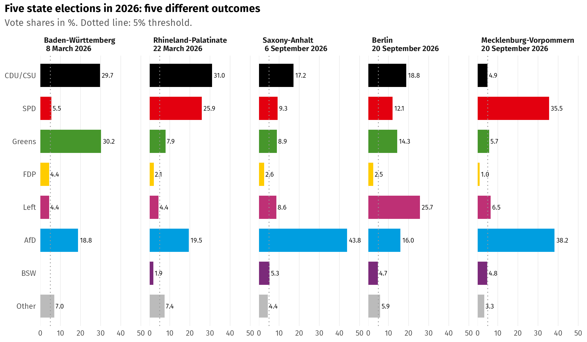]

<div class="src">Data: <a href="https://www.wahlrecht.de/ergebnisse/">wahlrecht.de</a>, own compilation. Berlin and Mecklenburg-Vorpommern preliminary results.</div>


---
class: inverse, center, middle

<span class="section-no">1</span>

# The centre is not cracking.
<html><div style='float:left'></div><hr color='#EB811B' size=1px style="width:1000px; margin:auto;"/></html>


---
# CDU/CSU and SPD have been losing ground since the 1980s

.fig[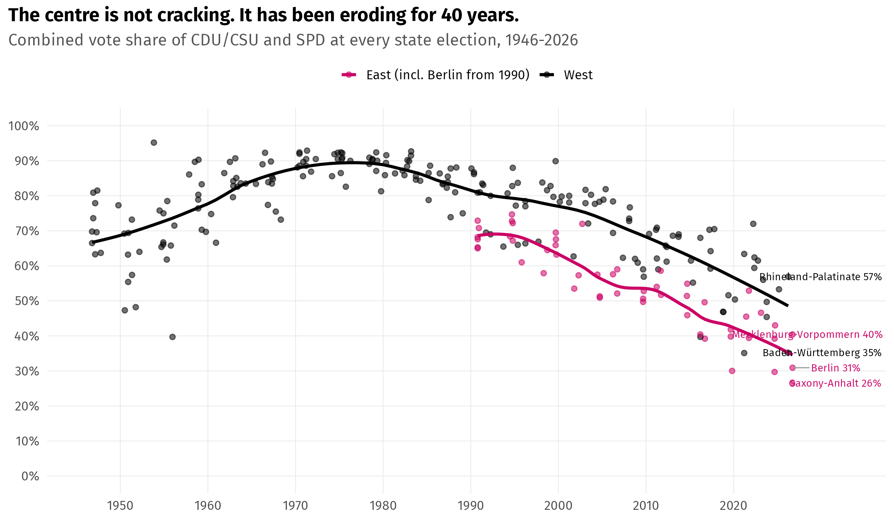]

.notes[
<div class="ta">Take-aways</div>

- Combined share: West <b style="color:#cc0065">89%</b> in the 1970s → <b style="color:#cc0065">54%</b> in the 2020s
- East: <b style="color:#cc0065">68%</b> in the 1990s → <b style="color:#cc0065">39%</b> today
- 1955–2015: the largest party at <b style="color:#cc0065">all 193</b> state elections was CDU/CSU or SPD. Since 2016: <b style="color:#cc0065">8 of 38</b> went elsewhere
]

<div class="src">Data: <a href="https://www.wahlrecht.de/ergebnisse/">wahlrecht.de</a>, own compilation.</div>


---
# State parliaments are more fragmented than ever

.fig[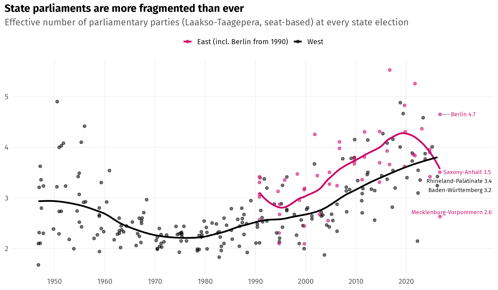]

.formula[
<b>Effective number of parties</b> (Laakso & Taagepera 1979)

$$N = \frac{1}{\sum_{i=1}^{n} s_i^2}$$

where $s_i$ is party $i$'s share of seats
]

.notes[
<div class="ta">Take-aways</div>

- Around <b style="color:#cc0065">2.2</b> in the West of the 1970s
- <b style="color:#cc0065">3.5 to 4.7</b> in the parliaments elected in 2026
- But: <b style="color:#cc0065">shrinking as AfD becomes dominant</b> in the East, FDP drops out
]

<div class="src">Data: <a href="https://www.wahlrecht.de/ergebnisse/">wahlrecht.de</a>, own compilation.</div>


---
class: inverse, center, middle

<span class="section-no">2</span>

# The far right is not a new kid on the block.
<html><div style='float:left'></div><hr color='#EB811B' size=1px style="width:1000px; margin:auto;"/></html>


---
# The far right in state parliaments is not new ...

.fig[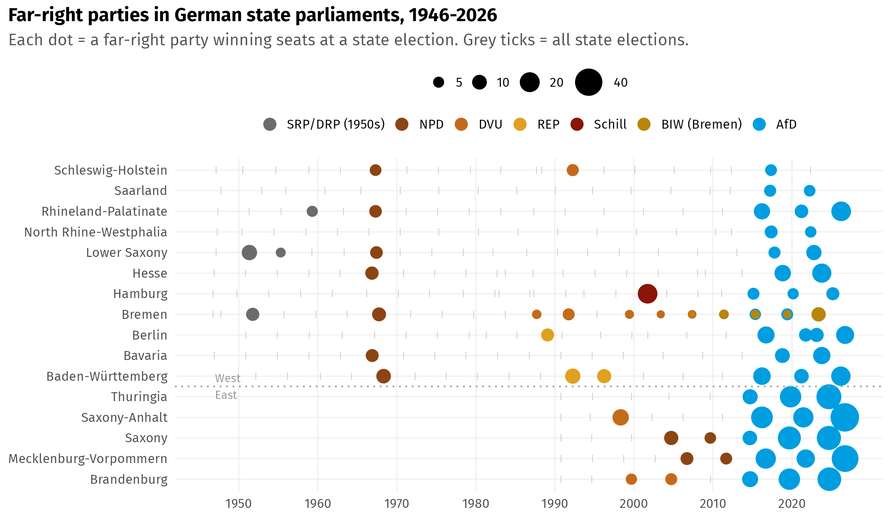]

.notes[
<div class="ta">Take-aways</div>

- NPD in <b style="color:#cc0065">seven Landtage at once</b> in 1968–70
- DVU, REP and Schill in the 1990s and 2000s, mostly for a single term
- The AfD since 2014: <b style="color:#cc0065">all 16</b> states
]

<div class="src">Data: <a href="https://www.wahlrecht.de/ergebnisse/">wahlrecht.de</a>, own compilation. Bremen: DVU/BIW seats via the separate Bremerhaven threshold.</div>


---
# ... but the AfD is a different animal

.fig[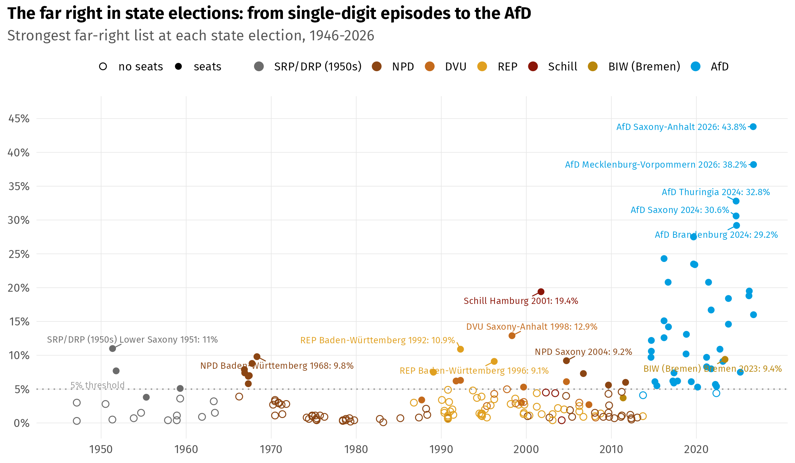]

.notes[
<div class="ta">Take-aways</div>

- Before the AfD: <b style="color:#cc0065">34</b> entries, average <b style="color:#cc0065">6.7%</b>, best 19.4% (Schill, Hamburg 2001), only <b style="color:#cc0065">1 in 3</b> re-elected
- The AfD: <b style="color:#cc0065">41</b> entries, average <b style="color:#cc0065">15%</b>, <b style="color:#cc0065">9 in 10</b> re-elected, always stronger
- 2026: <b style="color:#cc0065">47%</b> of seats in Saxony-Anhalt, 45% in MV
]

<div class="src">Data: <a href="https://www.wahlrecht.de/ergebnisse/">wahlrecht.de</a>, own compilation.</div>


---
# The recent AfD surge is smaller than it looks

.fig[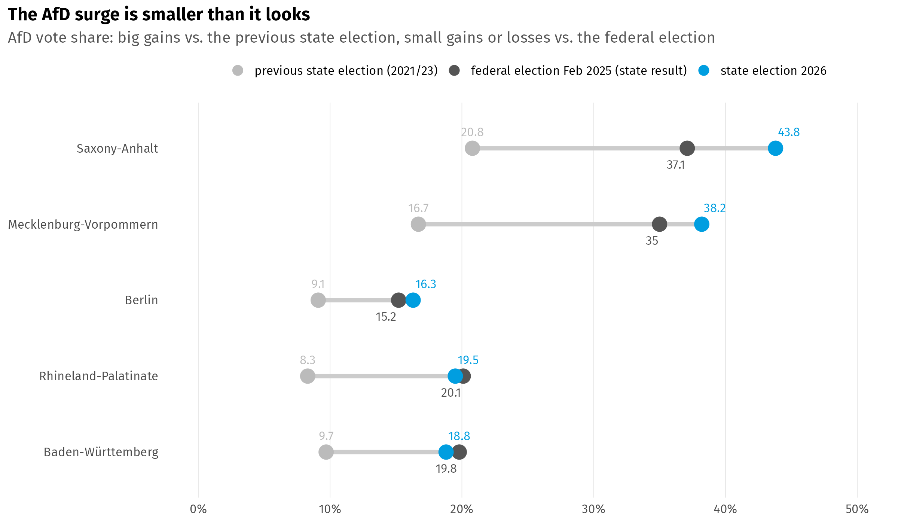]

.notes[
<div class="ta">Take-aways</div>

- Against the previous state election: <b style="color:#cc0065">+23</b>, +21.5 and +7 points in the September elections
- Against the February 2025 federal result in the same state: <b style="color:#cc0065">+6.7</b>, +3.2 and +1.1
- In the March elections the AfD even <b style="color:#cc0065">underperformed</b> its federal result
]

<div class="src">Data: <a href="https://www.wahlrecht.de/ergebnisse/">wahlrecht.de</a>, <a href="https://www.bundeswahlleiterin.de/bundestagswahlen/2025/ergebnisse.html">Bundeswahlleiterin</a>, own compilation. Inspired by: <a href="https://bsky.app/profile/nilssteiner.bsky.social/post/3mvy5n3azt22p">Nils Steiner</a>.</div>


---
class: inverse, center, middle

<span class="section-no">3</span>

# Age, education, and geography are defining cleavages.
<html><div style='float:left'></div><hr color='#EB811B' size=1px style="width:1000px; margin:auto;"/></html>


---
# Support for the centre is dying out

.fig[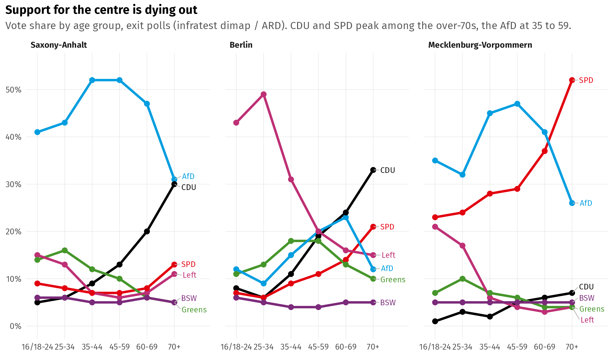]

.notes[
<div class="ta">Take-aways</div>

- CDU under 25: <b style="color:#cc0065">5%</b> in Saxony-Anhalt, <b style="color:#cc0065">1%</b> in MV; the SPD's best group is the over-70s
- The AfD peaks at <b style="color:#cc0065">35–59</b> everywhere and is weakest among the oldest
- Berlin under 35: <b style="color:#cc0065">43–49%</b> Die Linke
]

<div class="src">Data: <a href="https://www.kas.de/de/monitor-wahl-und-sozialforschung">infratest dimap exit polls, via KAS Wahlanalysen</a>, own compilation. Inspired by: <a href="https://www.zeit.de/politik/deutschland/2026-09/wahlverhalten-junge-menschen-ostdeutschland-volksparteien-cdu-spd">Thorsten Faas</a>.</div>


---
# The AfD's steep education gradient

.fig[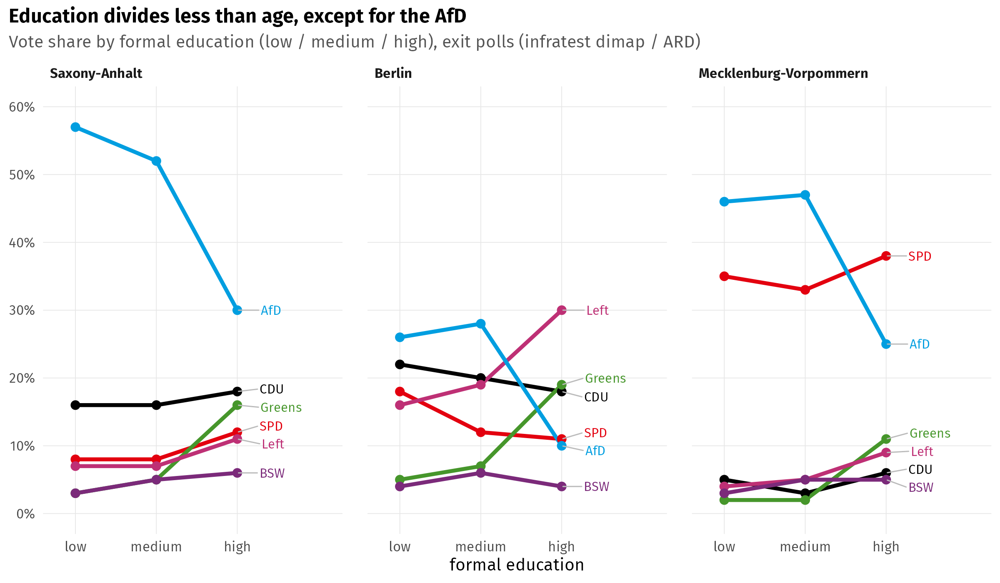]

.notes[
<div class="ta">Take-aways</div>

- AfD by education (low / medium / high): <b style="color:#cc0065">57 / 52 / 30</b> in Saxony-Anhalt, 46 / 47 / 25 in MV, 26 / 28 / 10 in Berlin
- The Linke and Greens run the other way
]

<div class="src">Data: <a href="https://www.kas.de/de/monitor-wahl-und-sozialforschung">infratest dimap exit polls, via KAS Wahlanalysen</a>, own compilation. Inspired by: <a href="https://bsky.app/profile/tabouchadi.bsky.social/post/3mvy3gz4vfc2w">Tarik Abou-Chadi</a>.</div>


---
# Village vs. city: the AfD vote falls with municipality size

.fig[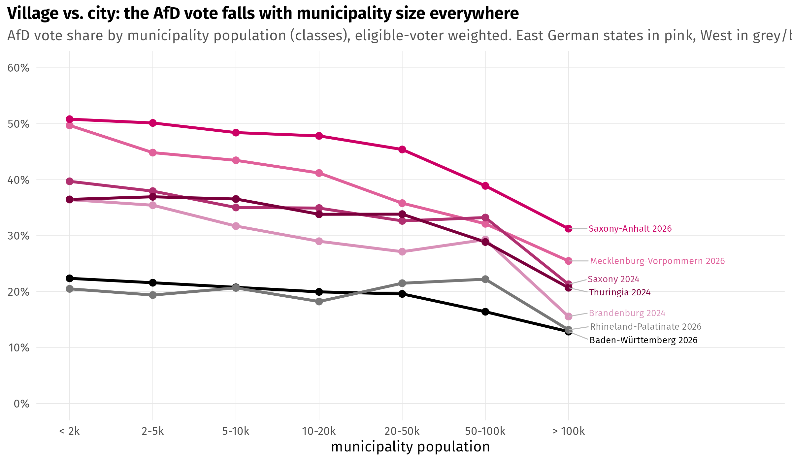]

.notes[
<div class="ta">Take-aways</div>

- Village-to-city gap: <b style="color:#cc0065">16–24 points</b> in the East, <b style="color:#cc0065">7–10</b> in the West
- Saxony-Anhalt: 51% in villages under 2,000, 31% in the big cities
- Only the AfD has this gradient; Greens and Linke are its mirror image
]

<div class="src">Data: <a href="https://www.german-elections.com/">GERDA</a>, <a href="https://wahlen.mvnet.de/wahl/land">Landeswahlleitung MV</a>, own compilation. Inspired by: <a href="https://juliuskoelzer.de/saxony-anhalt-2026-en/">Julius Kölzer</a>.</div>


---
# Berlin: “The Ring is the new Wall”

.fig.sq[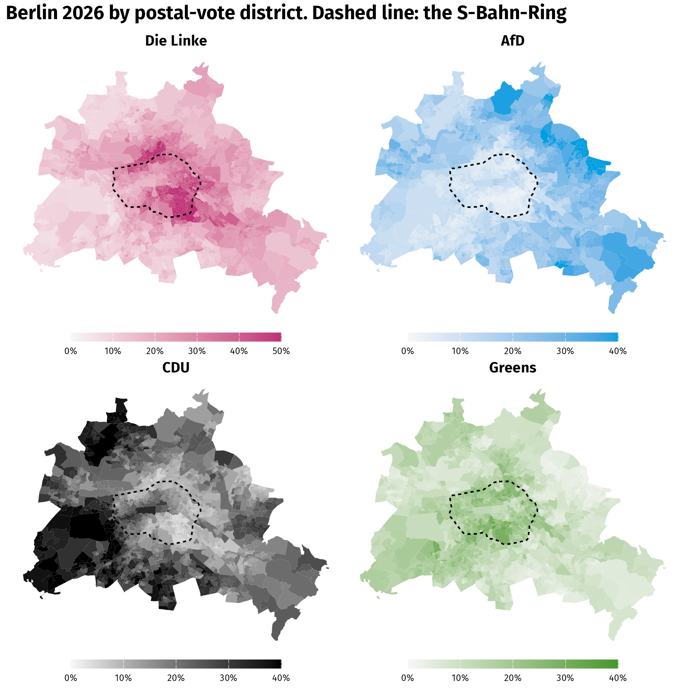]

.notes[
<div class="ta">Take-aways</div>

- Left bloc inside the S-Bahn-Ring: <b style="color:#cc0065">67%</b> East, <b style="color:#cc0065">68%</b> West. Outside: 45% East, 47% West
- The AfD still carries the old border: 25% East outside, 16% West outside
- The CDU remains strong in the South-West and North-West
]

<div class="src">Data: <a href="https://www.wahlen-berlin.de/wahlen/BE2026/AFSPRAES/agh/downloads.html">Landeswahlleiterin Berlin / AfS Berlin-Brandenburg</a>, <a href="https://gdi.berlin.de/">gdi.berlin.de</a>, OpenStreetMap, own compilation. Inspired by: <a href="https://interaktiv.tagesspiegel.de/lab/der-berliner-mamdani-effekt-jung-migrantisch-zentrumsnah-wo-die-linke-stark-geworden-ist/">Tagesspiegel / Julius Kölzer</a>.</div>

---
# Berlin: “The Ring is the new Wall”

.fig[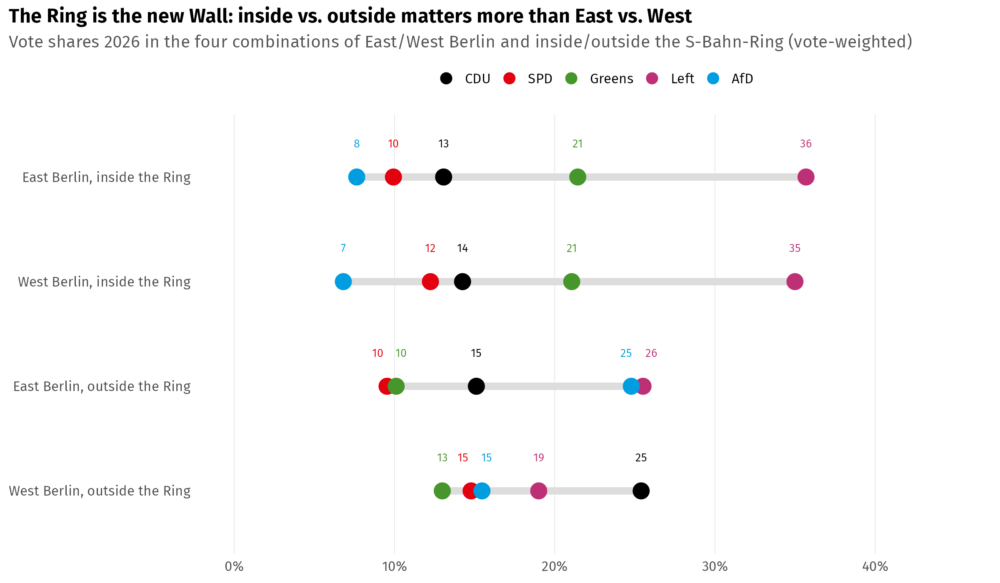]

.notes[
<div class="ta">Take-aways</div>

- Left bloc inside the S-Bahn-Ring: <b style="color:#cc0065">67%</b> East, <b style="color:#cc0065">68%</b> West. Outside: 45% East, 47% West
- The AfD still carries the old border: 25% East outside, 16% West outside
- The CDU remains strong in the South-West and North-West
]

<div class="src">Data: <a href="https://www.wahlen-berlin.de/wahlen/BE2026/AFSPRAES/agh/downloads.html">Landeswahlleiterin Berlin / AfS Berlin-Brandenburg</a>, <a href="https://gdi.berlin.de/">gdi.berlin.de</a>, OpenStreetMap, own compilation. Inspired by: <a href="https://interaktiv.tagesspiegel.de/lab/der-berliner-mamdani-effekt-jung-migrantisch-zentrumsnah-wo-die-linke-stark-geworden-ist/">Tagesspiegel / Julius Kölzer</a>.</div>


---
class: inverse, center, middle

<span class="section-no">4</span>

# Turnout is back.
<html><div style='float:left'></div><hr color='#EB811B' size=1px style="width:1000px; margin:auto;"/></html>


---
# Turnout is back. The East now votes more than the West.

.fig[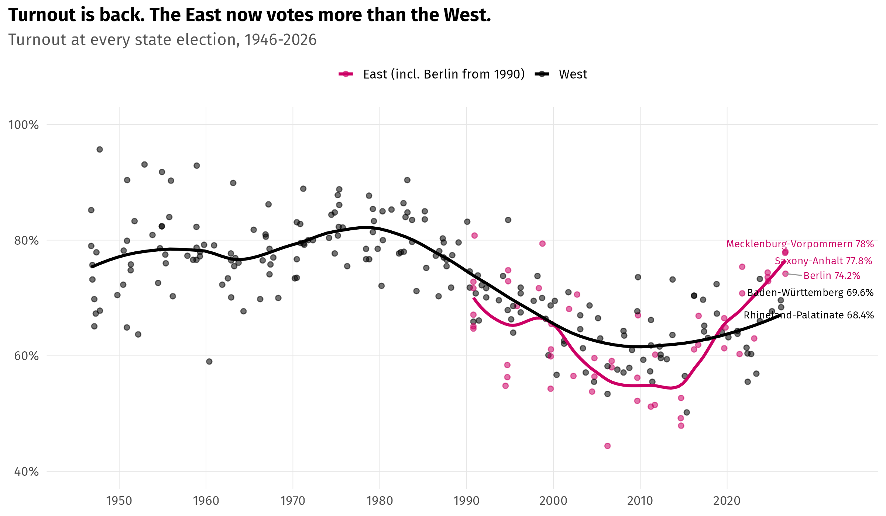]

.notes[
<div class="ta">Take-aways</div>

- East German turnout fell to the low 50s in the 2000s and 2010s
- 2026: <b style="color:#cc0065">78%</b> in MV and Saxony-Anhalt, 74% in Berlin
- Saxony-Anhalt: <b style="color:#cc0065">+17.5</b> points, the largest increase at any state election since 1990
]

<div class="src">Data: <a href="https://www.wahlrecht.de/ergebnisse/">wahlrecht.de</a>, own compilation. Inspired by: <a href="https://juliuskoelzer.de/saxony-anhalt-2026-en/">Julius Kölzer</a>.</div>


---
# ... and the new voters went mostly one way

.fig[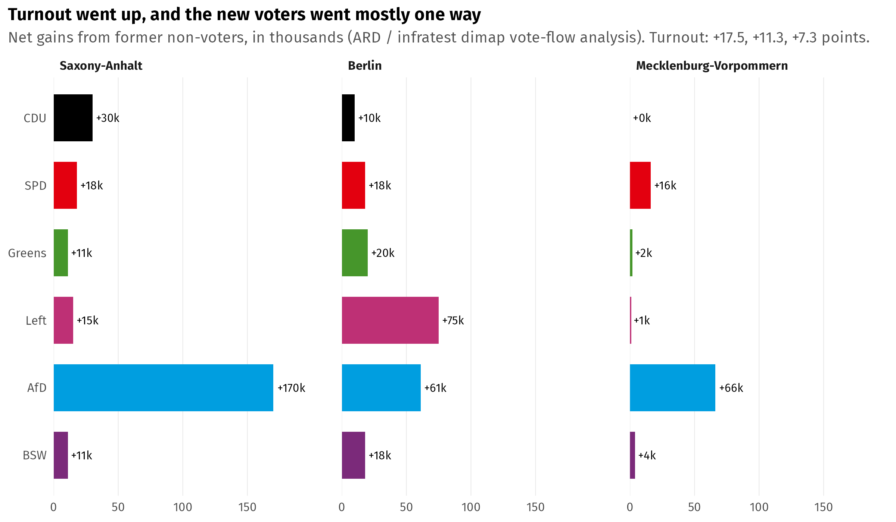]

.notes[
<div class="ta">Take-aways</div>

- S-A: AfD <b style="color:#cc0065">+170k</b> from former non-voters, all other parties together +96k
- Berlin is the exception: the Linke mobilised more (+75k) than the AfD (+61k)
- Centre and left mostly <b style="color:#cc0065">trade votes among themselves</b>; the AfD also takes from the CDU (−83k, −60k, −32k)
]

<div class="src">Data: <a href="https://www.kas.de/de/monitor-wahl-und-sozialforschung">ARD / infratest dimap vote-flow analysis, via KAS Wahlanalysen</a>, own compilation. Inspired by: <a href="https://bsky.app/profile/juliusk.bsky.social/post/3mvz7smwnb22e">Julius Kölzer</a>.</div>


---
# ... and they are probably not going away any time soon

.fig[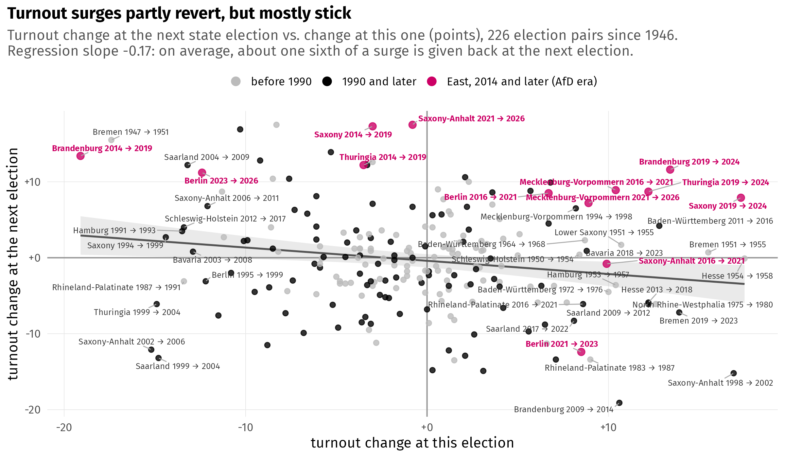]

.notes[
<div class="ta">Take-aways</div>

- 226 state-election pairs since 1946: only about <b style="color:#cc0065">one sixth</b> of a turnout surge is given back next time
- Every East German surge since 2014 was followed by a <b style="color:#cc0065">further rise</b>
- Voting is habit-forming: <b style="color:#cc0065">+5 to +15</b> points next time, strongest for first-time voters
]

<div class="src">Data: <a href="https://www.wahlrecht.de/ergebnisse/">wahlrecht.de</a>, own compilation. Literature: <a href="https://onlinelibrary.wiley.com/doi/10.1111/ajps.12210">Coppock & Green 2016</a>, <a href="https://www.aeaweb.org/articles?id=10.1257/app.20140533">Fujiwara, Meng & Vogl 2016</a>, <a href="https://link.springer.com/chapter/10.1007/978-3-658-42694-1_4">Schäfer 2023</a>.</div>


---
exclude: true

# Data journalism and researchers did the heavy lifting

.jl[
<div class="clips">
<div class="clip c1"><span class="outlet">Tagesspiegel</span><br><a href="https://interaktiv.tagesspiegel.de/lab/der-berliner-mamdani-effekt-jung-migrantisch-zentrumsnah-wo-die-linke-stark-geworden-ist/">Elf Karten und Grafiken zeigen Berlins neue politische Geografie: Jung, links, migrantisch – ist es der Mamdani-Effekt?</a><br><span class="meta">22 Sept 2026 · Breher, Donheiser, Kölzer, Tröbs, Wittlich</span></div>
<div class="clip c2"><span class="outlet">Der Spiegel</span><br><a href="https://www.spiegel.de/politik/deutschland/berlin-abgeordnetenhauswahl-wie-die-linke-berlin-erobert-hat-a-4422f96d-65c5-4943-b78d-50ccc9874e8c">Wahl zum Abgeordnetenhaus: So hat die Linke Berlin erobert</a><br><span class="meta">21 Sept 2026 · Wilkin, Stotz, Pauly, Dambeck</span></div>
<div class="clip c3"><span class="outlet">DIE ZEIT</span><br><a href="https://www.zeit.de/2026/41/landtagswahlen-sachsen-anhalt-berlin-mecklenburg-vorpommern-taktisches-waehlen">Fünf Lehren, die von den Wahlen bleiben werden</a><br><span class="meta">26 Sept 2026 · Valerie Schönian</span></div>
<div class="clip c4"><span class="outlet">NZZ Visuals</span><br><a href="https://www.nzz.ch/visuals/wahl-in-berlin-2026-alle-ergebnisse-im-ueberblick-ld.10024505">Wahl in Berlin 2026 – Ergebnisse und Koalitionen in Karten und Grafiken</a><br><span class="meta">20 Sept 2026 · Off, Kissling, Mayer</span></div>
<div class="clip c5"><span class="outlet">The Guardian</span><br><a href="https://www.theguardian.com/world/2026/sep/07/why-far-right-afd-state-victory-significant-german-politics-germany-explainer">Why is the far-right AfD’s state victory significant and what might happen next in German politics?</a><br><span class="meta">7 Sept 2026 · Deborah Cole</span></div>
<div class="clip c6"><span class="outlet">The Economist</span><br><a href="https://www.economist.com/leaders/2026/09/08/what-should-germany-do-about-its-rising-right">What should Germany do about its rising right?</a><br><span class="meta">8 Sept 2026 · Leader</span></div>
<div class="clip c7"><span class="outlet">Financial Times</span><br><a href="https://www.ft.com/content/7cf54faa-90d7-4f2b-a626-a57fb402be61">Red lipstick and expropriation: anti-capitalist seeks power in Berlin</a><br><span class="meta">18 Sept 2026</span></div>
<div class="clip c8"><span class="outlet">New York Times</span><br><a href="https://www.nytimes.com/2026/09/07/world/europe/germany-afd-election-saxony-anhalt-election.html">Germany’s ‘Firewall’ Against the Far Right Is Being Tested as Never Before</a><br><span class="meta">7 Sept 2026 · Jim Tankersley</span></div>
</div>
]

.jr[
<div class="people3">
<div class="person"><b>Julius Kölzer</b><a href="https://juliuskoelzer.de/saxony-anhalt-2026-en/">juliuskoelzer.de</a></div>
<div class="person"><b>Nils Steiner</b><a href="https://bsky.app/profile/nilssteiner.bsky.social/post/3mvy5n3azt22p">Bluesky: AfD vs. 2025</a></div>
<div class="person"><b>Thorsten Faas</b><a href="https://www.zeit.de/politik/deutschland/2026-09/wahlverhalten-junge-menschen-ostdeutschland-volksparteien-cdu-spd">ZEIT: Union und SPD</a></div>
<div class="person">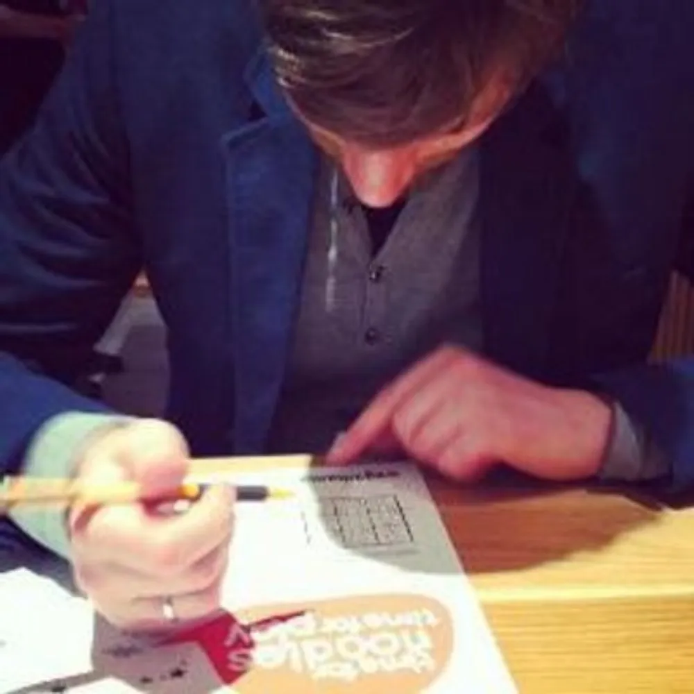<b>Ansgar Wolsing</b><a href="https://bsky.app/profile/wahlforschung.thorstenfaas.de/post/3mvz3lkpia22n">Bluesky: Buntes Berlin</a></div>
<div class="person"><b>Tarik Abou-Chadi</b><a href="https://bsky.app/profile/tabouchadi.bsky.social/post/3mvy3gz4vfc2w">Bluesky: SPD in MV</a></div>
<div class="person"><b>Céline Teney</b><a href="https://www.fu-berlin.de/presse/informationen/fup/2026/fup_26_082-afd-waehlerschaft-typen/index.html">FU: AfD voter types</a></div>
<div class="person"><b>Tagesspiegel Lab</b><a href="https://interaktiv.tagesspiegel.de/lab/der-berliner-mamdani-effekt-jung-migrantisch-zentrumsnah-wo-die-linke-stark-geworden-ist/">Berlins politische Geografie</a></div>
<div class="person"><b>zweitstimme.org</b><a href="https://zweitstimme.org/blog/posts/be-mv-2026-evaluation/">Forecast evaluations</a></div>
<div class="person"><b>Armin Schäfer</b><a href="https://link.springer.com/chapter/10.1007/978-3-658-42694-1_4">Nichtwähler und die AfD</a></div>
</div>
]

---
# Do your own research! The data are at your disposal

<div class="panels">
<div class="panel"><a href="https://www.german-elections.com/">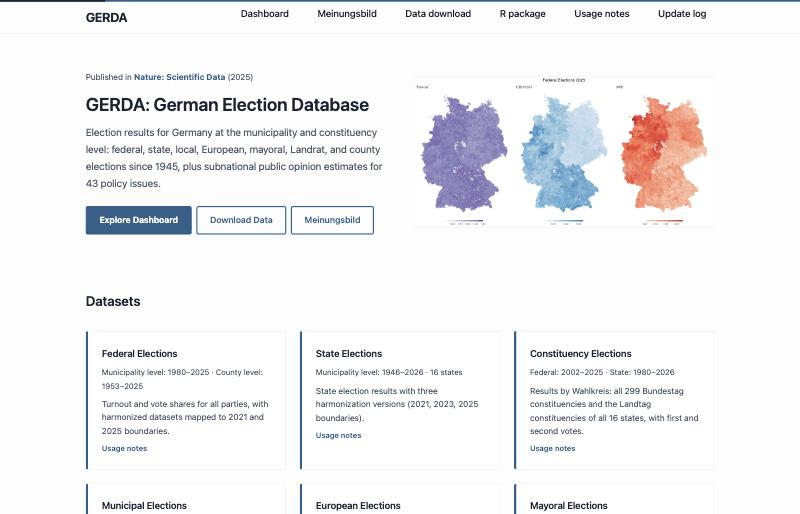</a><a href="https://www.german-elections.com/">GERDA</a><br><span>municipality- and constituency-level results 1946–2026, R package <code>gerda</code></span></div>
<div class="panel"><a href="https://www.wahlrecht.de/ergebnisse/">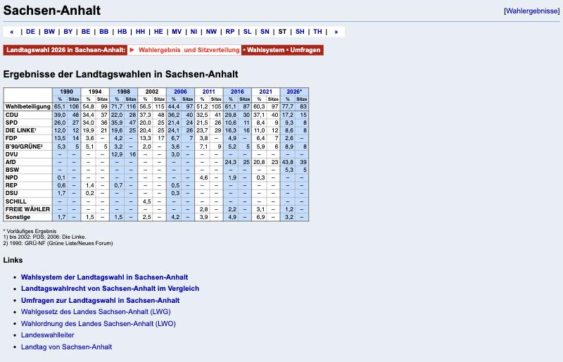</a><a href="https://www.wahlrecht.de/ergebnisse/">wahlrecht.de</a><br><span>every state election since 1946, all parties, seats, turnout</span></div>
<div class="panel"><a href="https://github.com/zweitstimme-org/polling-api">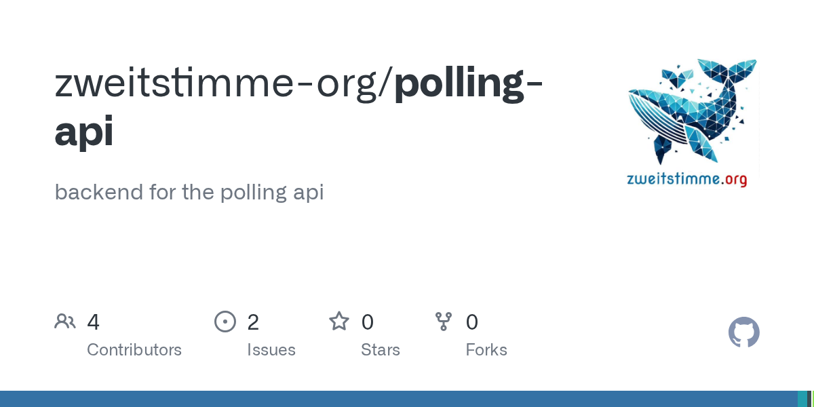</a><a href="https://github.com/zweitstimme-org/polling-api">zweitstimme polling API</a><br><span>polls, forecasts and scenarios for federal and state elections</span></div>
<div class="panel"><a href="https://statepol.github.io/Database/">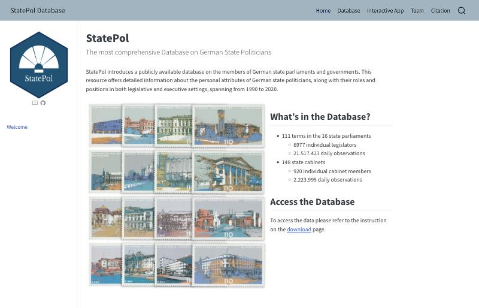</a><a href="https://statepol.github.io/Database/">StatePol</a><br><span>6,977 state legislators and 920 cabinet members, 1990–2020</span></div>
<div class="panel"><a href="https://www.bundeswahlleiterin.de/">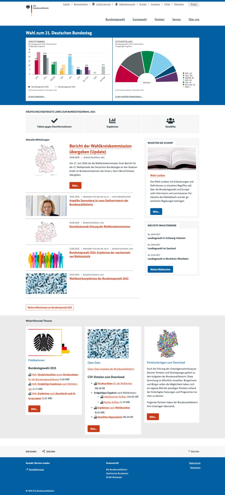</a><a href="https://www.bundeswahlleiterin.de/">Bundeswahlleitung + Landeswahlleitungen</a><br><span>Repräsentative Wahlstatistik; precinct-level CSVs on election night</span></div>
<div class="panel"><a href="https://gles.eu/"></a><a href="https://gles.eu/">GLES</a><br><span>panel and cross-section surveys for voter typologies and non-voter dynamics</span></div>
</div>


---
<br>

<div style="text-align:center;">
<span style="font-family:'Nothing You Could Do', bold; font-size:3.2rem; font-weight:400;">Slides, code and data</span>
</div>

<div align="center" style="margin-top:20px;">

</div>

<div style="text-align:center; margin-top:16px; font-size:1.3rem;">
<a href="https://simonmunzert.com/state-elections-2026"><b>simonmunzert.com/state-elections-2026</b></a><br>
<a href="https://github.com/simonmunzert/state-elections-2026"><b>github.com/simonmunzert/state-elections-2026</b></a>
</div>
